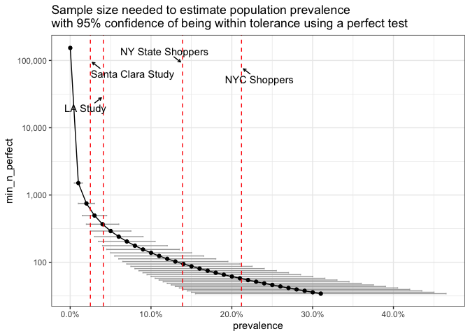
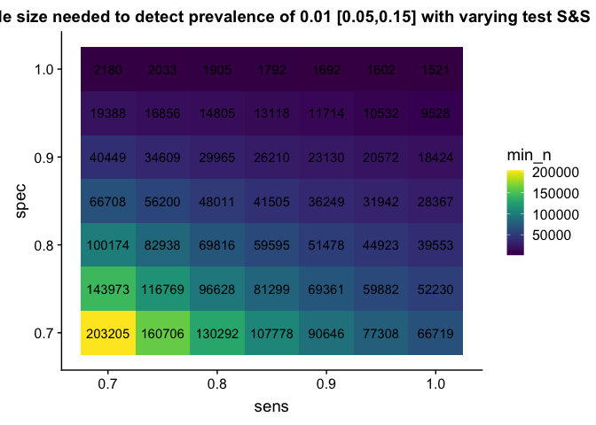

Serology Testing Sample Size Estimation
================
CS472
4/27/2020

Serology Testing Exploration
----------------------------

### Questions:

1.  Q1: How large does sample size need to be to detect prevalence levels using a perfect test?
2.  Q2: How large does sample size need to be to detect prevalence levels using an imperfect test?
3.  Q3: For a set prevalence, how does sensitivity and specificity affect needed sample size?

### Resources

1.  Humphry 2004 <https://www.sciencedirect.com/science/article/pii/S0167587704001412>
2.  Arya 2012 <https://link.springer.com/article/10.1007/s12098-012-0763-3>

### Q1: How large does sample size need to be to detect prevalence levels using a perfect test?

Use normal approximation to binomial distribution to determine minimum *n* to detect prevalence *p* with tolerance *d* at desired confidence interval *z*

$n = (\\frac{z}{d})^2 \* p (1 - p))$

``` r
# Set up data

# Dummy frame for reported prevalence values
reported_prev <- data.frame(
  area = c("NY State Shoppers", "NYC Shoppers", "LA Study", "Santa Clara Study"),
  prev = c(0.139, 0.212, 0.041, 0.025)
)

# Z score for 95% CI
z = 1.96

# PREVALENCE RANGE 
# based on reported prevalences
min_prev = 0.0001 # infinity for zero
max_prev = max(reported_prev$prev + 0.1)

# TOLERANCE LEVEL (ALLOWABLE ERROR)
# Conventionally, an ‘absolute’ allowable error margin d of 5 % is chosen, 
# but, as is common in clinical practice, 
# if expected prevalence P is <10 %, 
# the 95 % confidence boundaries may cross 0, which is impractical.
# A common recommendation is to set d = P/2 for rare 
# and d = (1-P)/2 for very common conditions


# Data frame of prevalence, tolerance, and min n
# Use simple formula for perfect etst
# min_n_perfect: 95% chance of estimating true prevalence at min sample size

result_df <- data.frame(prevalence = seq(min_prev, max_prev, by = .01)) %>%
  mutate(tolerance = ifelse(prevalence < 0.1 | prevalence > 0.9,
                            prevalence/2,
                            prevalence/2),
         min_n_perfect = ((z/tolerance)^2) * prevalence * (1 - prevalence))

# Plot estimates of prevalence vs min n
plot_q1 <- ggplot(data = result_df, 
       aes(x = prevalence, y = min_n_perfect)) +
    geom_errorbarh(aes(xmin = prevalence - tolerance, 
                     xmax = prevalence + tolerance),
                 color = "darkgray") +
  geom_point() +
  geom_line() +

  theme_bw() +
  geom_vline(xintercept = reported_prev$prev, 
             linetype = "dashed", 
             color = "red") +
  geom_text_repel(data = reported_prev,
                    aes(y = sample(10000:100000, nrow(reported_prev)),
                        x = prev,
                        label = area),
                    box.padding = 0.3,
                  point.padding = 0.3,
                    arrow = arrow(ends = "last", length = unit(0.1, "cm"))
                   ) +
  scale_y_log10(labels = comma) +
  scale_x_continuous(labels = percent) +
  ggtitle("Sample size needed to estimate population prevalence\nwith 95% confidence of being within tolerance using a perfect test")

plot_q1
```



### Q2: How large does sample size need to be to detect prevalence levels using an imperfect test?

Same as Eq. 1, but incorporate sensitivity and specificity. See Humphry 2014 Eq. 2

x = sensitivity y = specificity $n = (\\frac{z}{d})^2 \\frac{xp + (1-x) \* (1-p) \*(1- xp - (1-y)(1-p))}{(x - y - 1)^2}$

``` r
# Imperfect test - with sensitivity and specificity
# Rogan and Gladen 1978
# Assume normal approximation to binomial distribution

# Vary sensitivity and specificity
# For now hardcode values around Marson paper estimates
sens = 0.8
spec = 0.8

imp_result_df <- result_df %>%
 mutate(sens = sens,
        spec = spec,
        min_n_imperfect = (z/tolerance)^2 * 
          ((sens * prevalence) + (1 - spec)*(1 - prevalence)) * 
          (1 - (sens * prevalence) - (1 - spec)* (1 - prevalence)) / 
          (sens + spec - 1)^2
 )

plot_q2 <- ggplot(data = imp_result_df, 
       aes(x = prevalence, y = min_n_imperfect)) +
    geom_errorbarh(aes(xmin = prevalence - tolerance/2, 
                     xmax = prevalence + tolerance/2),
                 color = "darkgray") +
  geom_point() +
  geom_line() +
  theme_bw() +
  geom_vline(xintercept = reported_prev$prev, 
             linetype = "dashed", 
             color = "red") +
  geom_text_repel(data = reported_prev,
                    aes(y = sample(1000000:10000000, nrow(reported_prev)),
                        x = prev,
                        label = area),
                    box.padding = 0.3,
                  point.padding = 0.3,
                    arrow = arrow(ends = "last", length = unit(0.1, "cm"))
                   ) +
  scale_y_log10(labels = comma) +
  scale_x_continuous(labels = percent) +
  ggtitle(paste0("Sample size needed to estimate population prevalence\nwith 95% confidence of being within tolerance\nusing an imperfect test: Sensitivity = ", sens, " Specificity = ", spec))

plot_q2
```


### Q3: For a set prevalence, how does sensitivity and specificity affect needed sample size?

``` r
# Use same formula for imperfect test as in Q2
# Set prevalence to 0.1 

# Reported sensitivity and specificity of tests
# Fill in with real data
reported_ss <- data.frame(
  test = c("test1", "test2", "test3"),
  sens = c(0.8,0.9,1),
  spec = c(0.8,0.9,1)
)

set_prev = 0.01
# Now vary sensitivity and specificity

q3_result_df <- data.frame(
  sens = seq(0.7,1, by = 0.05),
  spec = seq(0.7,1, by = 0.05)) %>%
  complete(sens, spec) %>%
 mutate(
   prevalence = set_prev,
   tolerance = ifelse(prevalence < 0.1 | prevalence > 0.9,
                            prevalence/2,
                            0.05),
   min_n = (z/tolerance)^2 * 
          ((sens * prevalence) + (1 - spec)*(1 - prevalence)) * 
          (1 - (sens * prevalence) - (1 - spec)* (1 - prevalence)) / 
          (sens + spec - 1)^2
 )

plot_q3 <- ggplot(data = q3_result_df, 
       aes(x = sens, y = spec)) +
  geom_tile(aes(fill = min_n, label = min_n)) +
  geom_text(aes(label = round(min_n, digits = 0))) +
  ggtitle(paste0("Sample size needed to detect prevalence of ", 
                 set_prev, " [0.05,0.15] with varying test S&S")) +
  scale_fill_viridis(discrete = F)
```

    ## Warning: Ignoring unknown aesthetics: label

``` r
plot_q3
```



``` r
p_test = 0.001
p_covid.test = seq(0,1, by = 0.1)
p_test.covid = seq(0, p_test*2, length.out = length(p_covid.test))

df <- data.frame(p_covid.test = p_covid.test,
           p_test.covid = p_test.covid) %>%
  expand(p_covid.test, p_test.covid) %>%
  mutate(p_covid = (p_test/p_test.covid) * p_covid.test) 

ggplot(data = df,
       aes(x =p_covid.test, y = p_covid,
           color = p_test / p_test.covid )) +
  geom_line(aes(group = p_test.covid)) +
  geom_abline(intercept = 0, slope = 1, color = "red") +
  scale_color_viridis(discrete = F)
```

    ## Warning: Removed 1 row(s) containing missing values (geom_path).


